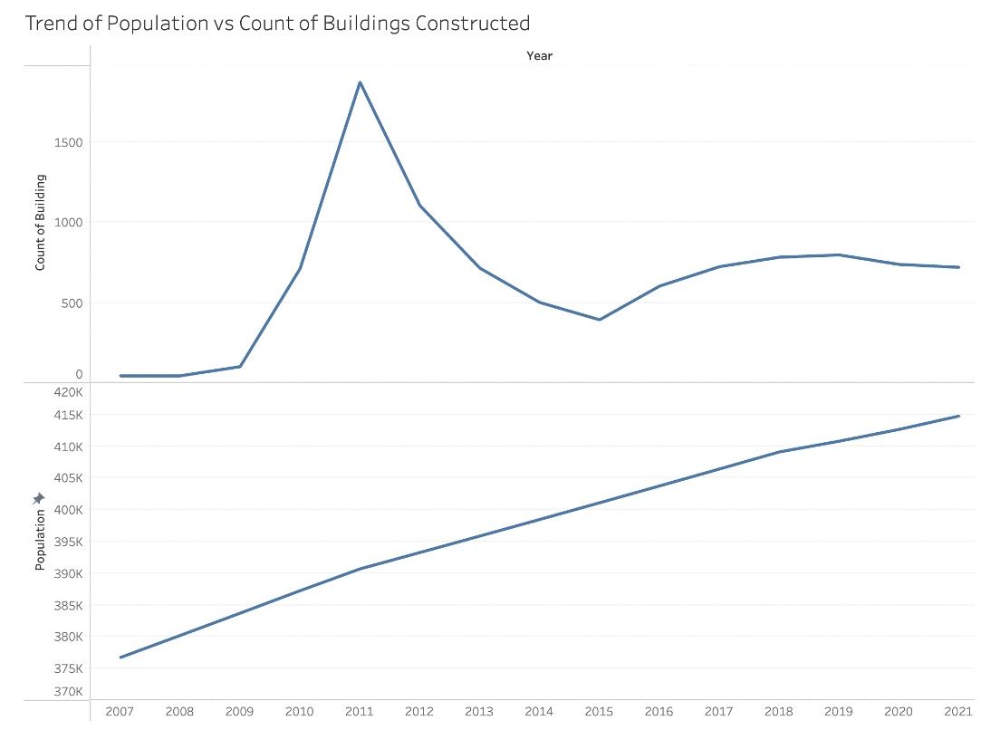

# Housing Crisis in Halifax
This project analyzes the housing crisis in Halifax Regional Municipality by comparing the housing demand with number of houses built. 

# Introduction
This project aims to identify the factors behind the housing crisis in Halifax Regional Municipality by analyzing the number of residential buildings contructed in the past 15 years. Along with this, identifying the number or permit issuance to build residential buildings and the time taken between permit requested and permit issued. 

Furthermore, I will be analyzing the population rate in Halifax in the next 10 years to identify how the housing demand will compare to the housing available in the coming future. 

# About the Dataset
- HRM Open Data Source: Building Details & Building Permit
  This contains the details about the number of Buildings constructed and different categories of         buildings in the last 15 years
- Statistics Canada: Halifax Population & Dwelling Counts
  This dataset contains the poplation growth rate in Halifax
- About Building Details, Building Permit, and Population 
  This dataset contains the necessary information about number of permits requested and number of         permits issued for different types of buildings. 
  
# Visualizations and Analysis

## What is the population growth rate in comparison to housing developed in Halifax Region?
<p align="center">
 
</p>

There is a dip in number of buildings contructed in 2008. Major contructions have taken place in 2009 to 2011 following an exponential dip till 2015. It has been stagnant since 2016. Overall, Population rise is not compatible with number of Buildings Constructed.

## What is the distribution of Building Classifications in Halifax?
<p align="center">
 
</p>

Residential buildings are dominating the overall construction. Recreational is second last although the budget is highest for recreation in terms of buildings. 

## Does the number of Residential Buildings constructed in the past 15 years match the population 
<p align="center">
 
</p>

The residential construction is not in pace with the requirements and the construction stagnated after 2016. 

## What are the types of buildings construction for residence?
<p align="center">
 
</p>

Single Unit Dwelling is dominant followed by Two Unit Dwelling. Since 2012, 2-unit dwellings and townhouses are also preferable.

## Which is the most populated area in Halifax Region?
<p align="center">
 
</p>

The prominent and the most preferable areas are Halifax, Bedford, and Middle Sackville. Geo Graph help us to understand the distribution of popular housing choices in HRM. Other areas can also be utilized if the hosuing crisis persist.

## Is the process of permit issuance for different building types quick?
<p align="center">
 
</p>

As shown in the figure, only 1 Permit was requested in 2006. Also, it is observed that processing time has increased over the years. Overall, permit issuance efficiency can be enhanced after taking other factors into consideration.

## Have the number of permits issued increased or decreased over the time?
<p align="center">
 
</p>

The figure shows that, permit issue process has become difficult and the processing time has increased over the years. Overall, permit issuance efficiency can be enhanced after taking other factors into consideration.

# Prediction of Population in Halifax Region using Linear Regression 

```
ggplot(data = data1, aes(x = Year, y = Population)) +
  geom_point() +
  stat_smooth(method = "lm", col = "dodgerblue3") +
  theme(panel.background = element_rect(fill = "white"),
        axis.line.x=element_line(),
        axis.line.y=element_line()) +
  ggtitle("Linear Model Fitted to Data")
```
<p align="center">
 
</p>

Linear Regression model can be applied using:

```
fit_1 <- lm(Population ~ Year, data = data1)
predict(fit_1, data.frame(Year=2002))
```
Population is increasing more than expected as the population in 2021 has already surpassed predicted population for 2023, which also raises the concern that the Housing is not in pace with population growth. 

# Conclusion

- Population is increasing rapidly in Halifax

- If the growth rate continues the issue of Housing may worsen over time

- Residential buildings must be constructed rapidly to overcome the issue 

- Multi Unit Dwellings can be constructed more as compared to Single Unit Dwelling to accommodate more people 

- The process of permits issuance can be fastened to speed up the process

